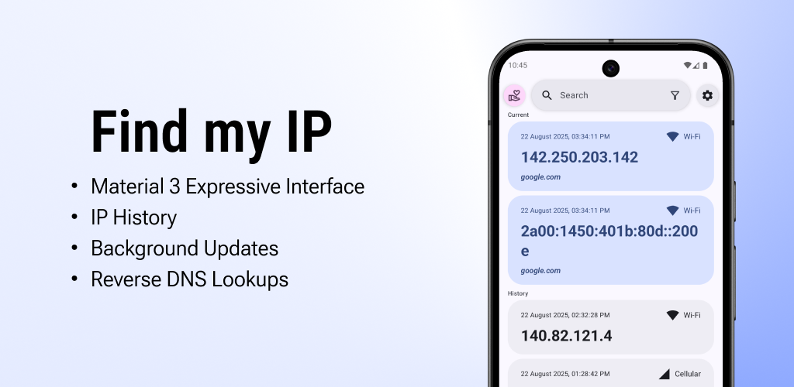
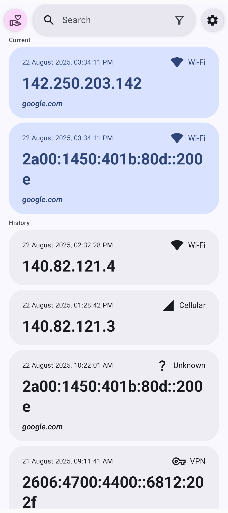
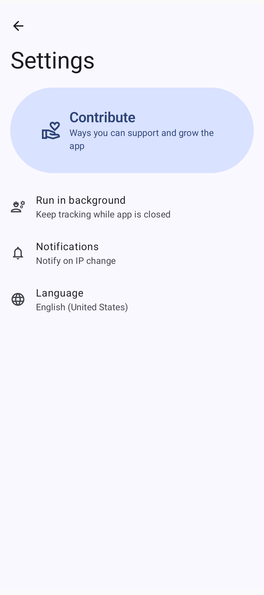
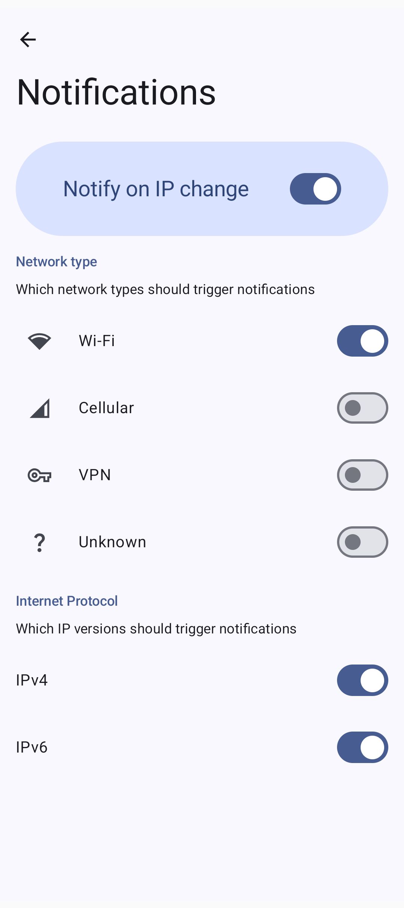

[🇬🇧English](./README.md) | [🇨🇳中文](./README.zh-CN.md)

---

[](f-droid.org/repository/browse/?fdid=com.maksimowiczm.findmyip)
[](https://github.com/maksimowiczm/find-my-ip/releases/latest/)
[](https://github.com/maksimowiczm/find-my-ip/releases/)
[](https://github.com/maksimowiczm/find-my-ip/stargazers)

<div align="center">
    
</div>
<div align="center">

[](https://f-droid.org/packages/com.maksimowiczm.findmyip)
[](https://github.com/maksimowiczm/find-my-ip/releases)

</div>

---

**Find my IP** 是一款轻量级应用，用于获取并存储您当前的 IP 地址。它会保存您过去 IP 的历史记录，并能在后台自动记录变更——无需每次都打开应用。

---

<div align="center">
    
    
    
</div>

---

### ✨ 特性

- 🎨 **[Material 3 Expressive](https://m3.material.io/blog/building-with-m3-expressive) 设计** -
  现代、简洁且友好的用户界面
- 🌐 **支持 IPv4 和 IPv6** - 无缝适用于两种 IP 地址类型
- 📜 **IP 历史记录** - 维护您过往 IP 地址的日志
- 🔔 **后台更新与通知** - 可选地在应用关闭时检测并通知您 IP 地址的变化
- 🧭 **反向 DNS 查询** - 将 IP 地址解析回域名

---

### 🎨 设计

在 [Figma](https://www.figma.com/design/BDNLirxKWIx8BljIWhEz6B/Find-my-IP) 上探索设计稿和原型

---

### 🤝 贡献

想帮助我们做得更好吗？这里有一些很棒的贡献方式：

- 🌍 **翻译应用** – 通过 [Crowdin](https://crowdin.com/project/find-my-ip) 帮助我们提升应用的国际化程度。如果您希望被署名，请告诉我
- 💡 **功能请求** – 有好点子吗？可以提交一个 [GitHub issue](https://github.com/maksimowiczm/find-my-ip/issues) 来建议新功能或改进
- 🐞 **报告 Bug** – 发现 Bug 了？通过 [GitHub issue](https://github.com/maksimowiczm/find-my-ip/issues) 提交，以便我们修复
- ⭐ **为项目点赞 (Star)** – 如果您喜欢这个项目，请给它一个 Star

---

### 📜 许可证


```
Copyright (C) 2024-2025 Mateusz Maksimowicz

This program is free software: you can redistribute it and/or modify it under the terms of the GNU General Public License as published by the Free Software Foundation, either version 3 of the License, or (at your option) any later version.

This program is distributed in the hope that it will be useful, but WITHOUT ANY WARRANTY; without even the implied warranty of MERCHANTABILITY or FITNESS FOR A PARTICULAR PURPOSE. See the GNU General Public License for more details.

You should have received a copy of the GNU General Public License along with this program. If not, see <https://www.gnu.org/licenses/>.
```
